# 📁 Image Gallery

Auto-generated gallery of all images.
---

## 📂 Assets

<a href='https://github.com/ryokr/Share/blob/main/Assets/button_info.png' target='_blank'>
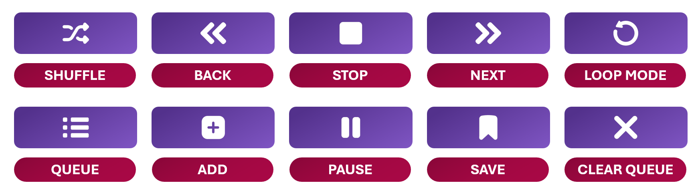
</a>

<a href='https://github.com/ryokr/Share/blob/main/Assets/Preview2.png' target='_blank'>
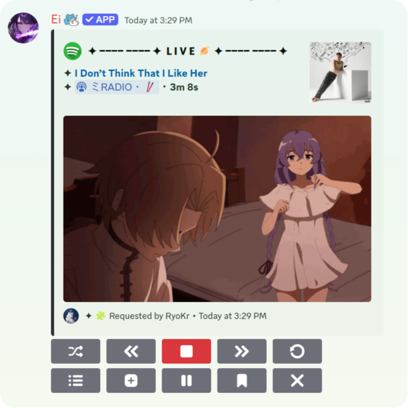
</a>
<a href='https://github.com/ryokr/Share/blob/main/Assets/Preview3.png' target='_blank'>
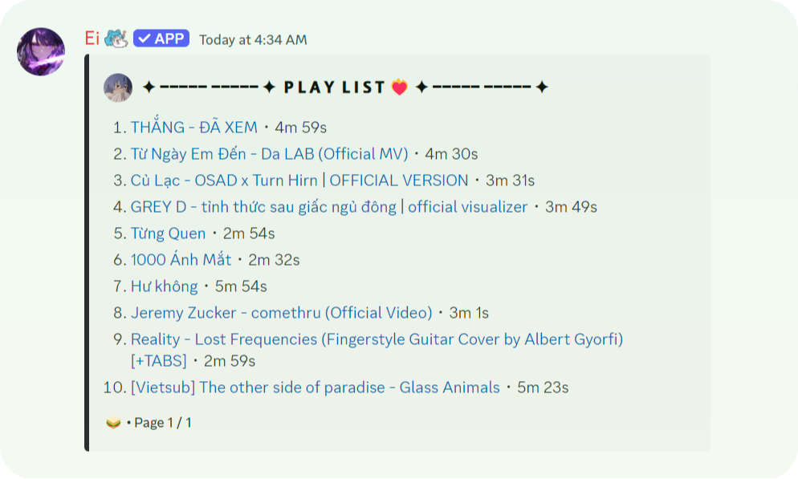
</a>
<a href='https://github.com/ryokr/Share/blob/main/Assets/Preview4.png' target='_blank'>
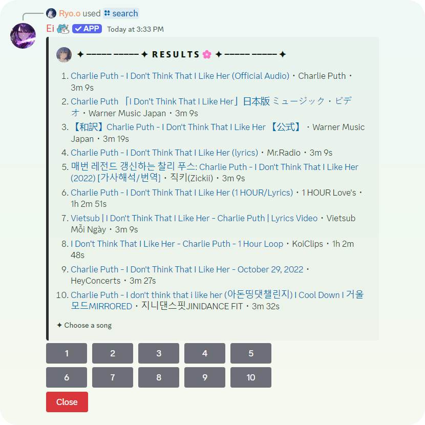
</a>
<a href='https://github.com/ryokr/Share/blob/main/Assets/Preview5.png' target='_blank'>
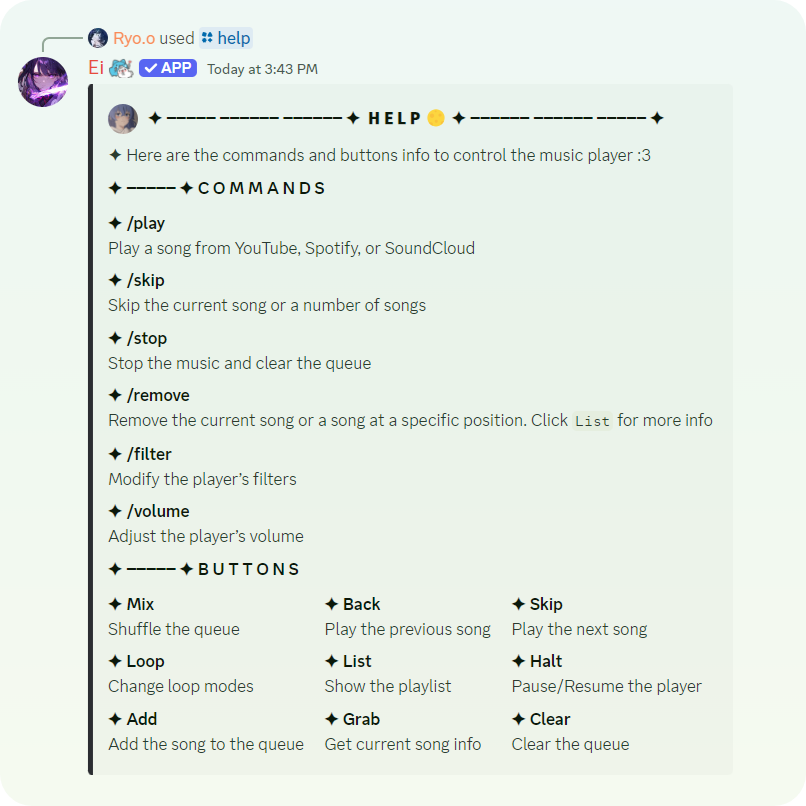
</a>
<a href='https://github.com/ryokr/Share/blob/main/Assets/robin2.jpg' target='_blank'>
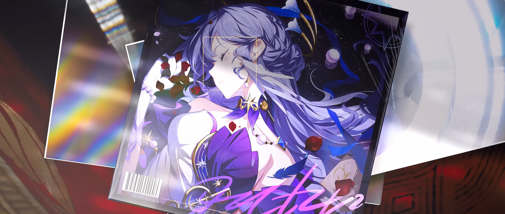
</a>

---

## 📂 Banners

<a href='https://github.com/ryokr/Share/blob/main/Banners/cloud.svg' target='_blank'>
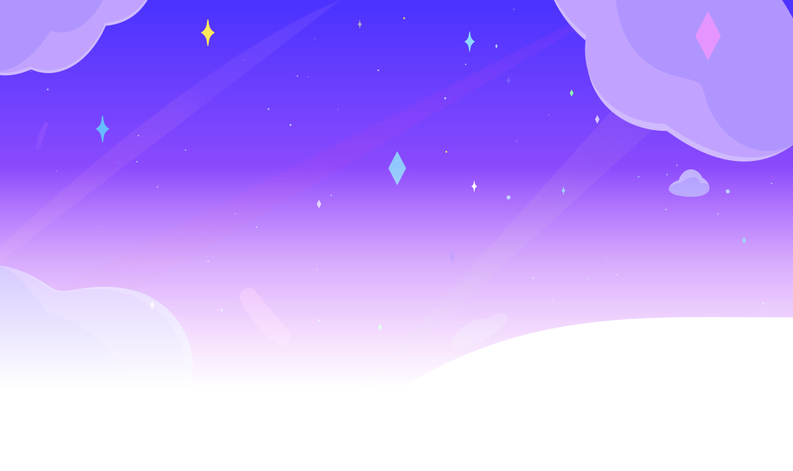
</a>
<a href='https://github.com/ryokr/Share/blob/main/Banners/dance_chill.gif' target='_blank'>
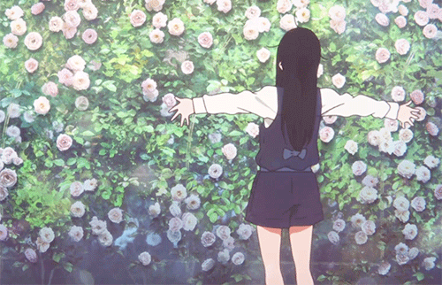
</a>

<a href='https://github.com/ryokr/Share/blob/main/Banners/patpat_alt.gif' target='_blank'>
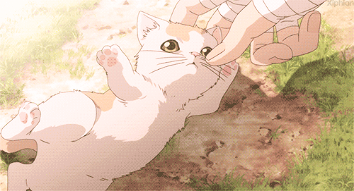
</a>
<a href='https://github.com/ryokr/Share/blob/main/Banners/patpat.gif' target='_blank'>
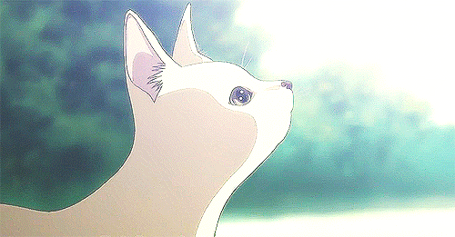
</a>

<a href='https://github.com/ryokr/Share/blob/main/Banners/river.gif' target='_blank'>
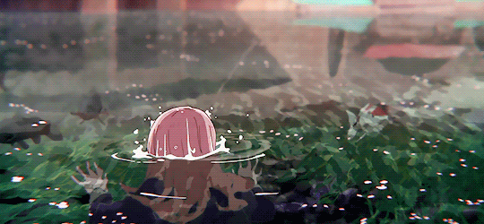
</a>
<a href='https://github.com/ryokr/Share/blob/main/Banners/rocket.svg' target='_blank'>
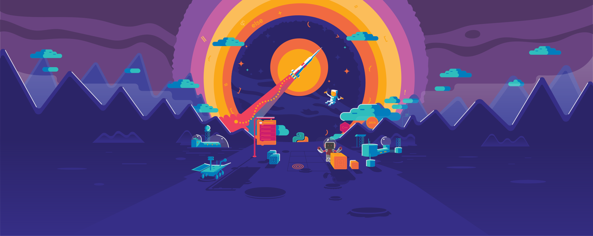
</a>

<a href='https://github.com/ryokr/Share/blob/main/Banners/wolf_children_chill_alt.gif' target='_blank'>
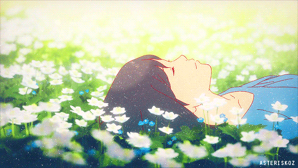
</a>
<a href='https://github.com/ryokr/Share/blob/main/Banners/wolf_children_chill.gif' target='_blank'>
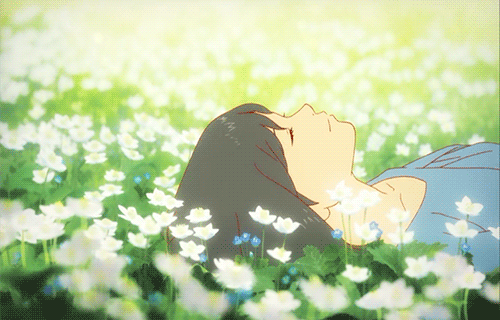
</a>

---

## 📂 Icons

<a href='https://github.com/ryokr/Share/blob/main/Icons/orange.png' target='_blank'>
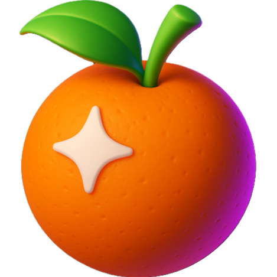
</a>

<a href='https://github.com/ryokr/Share/blob/main/Icons/tunip.png' target='_blank'>
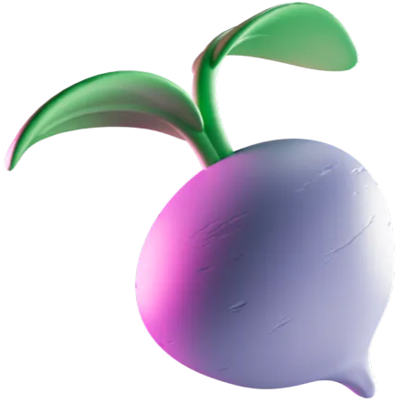
</a>
<a href='https://github.com/ryokr/Share/blob/main/Icons/V2_4K.png' target='_blank'>
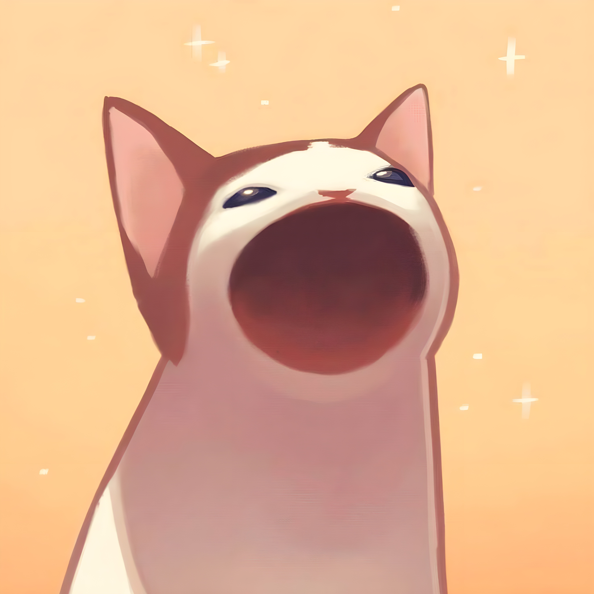
</a>

---

## 📂 Thumbnail

<a href='https://github.com/ryokr/Share/blob/main/Thumbnail/ei.gif' target='_blank'>
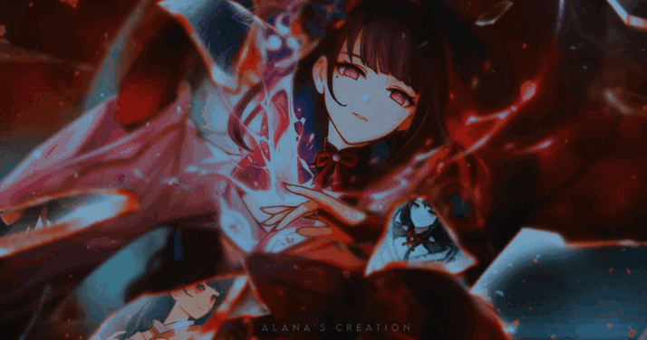
</a>

---

